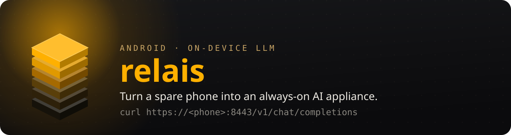

<!-- glowup:hero start -->
<picture>
  <source media="(prefers-color-scheme: dark)" srcset="docs/assets/banner.svg">
  <source media="(prefers-color-scheme: light)" srcset="docs/assets/banner-light.svg">
  
</picture>

[](https://github.com/ventouxlabs/relais/actions/workflows/build_android.yaml)
[](LICENSE)


<!-- glowup:hero end -->

# Relais

**Turn a spare Android phone into an always-on AI appliance — your own relay station for local inference.**

Relais runs an LLM directly on the phone's GPU with Google's
[LiteRT-LM](https://github.com/google-ai-edge/LiteRT-LM) runtime and serves it
over your LAN as a standard **OpenAI-compatible API** — `/v1/chat/completions`,
streaming SSE, API-key auth, mDNS discovery. Point any OpenAI client at the
phone's IP and it answers. Ollama, llama.cpp-server, and LM Studio all need a
desktop and can't reach a phone's neural silicon; Relais is **headless by
design** — no chat UI to babysit. It auto-starts, survives Doze, draws a few
watts, and sits on a shelf as private, cloud-free inference infrastructure you
operate rather than rent.

Spare flagship in, OpenAI endpoint out.

> Relais is a fork of Google's [AI Edge Gallery](https://github.com/google-ai-edge/gallery),
> rebuilt as a network **service** rather than an app. Licensed under
> **AGPL-3.0** (see [LICENSE](LICENSE) and [NOTICE](NOTICE)).

---

## What it is (and isn't)

- **Is:** a headless LAN inference node — one resident model on the phone GPU,
  exposed as an OpenAI-compatible HTTP API and hardened for always-on operation:
  foreground service, wake lock, Doze survival, crash/OOM auto-recovery,
  thermal backpressure, `/metrics`.
- **Isn't:** the fastest way to run a model. A desktop GPU crushes a phone on
  tokens/sec. Relais's value is *always-on, low-power, private, zero-marginal-cost*
  — small-model and agent/automation workloads, not 70B frontier serving.

**Prior art, honestly:** [OlliteRT](https://github.com/NightMean/OlliteRT) does
the same thing on the same runtime. Relais's bet is execution — Doze reliability,
Pixel/Tensor tuning, a real security posture (TLS on the LAN, encrypted key at
rest), and the control/observability surface.

---

## Requirements

- A device LiteRT-LM supports on GPU. Developed and validated on a **Pixel 9 Pro
  Fold** (Tensor G4), Android 12+ (`minSdk 31`).
- To build: **JDK 17+** and Android Studio with **SDK 35**. No NDK required —
  the inference engine ships as a prebuilt AAR.

## Clean-room bring-up

From fresh clone to serving node:

```bash
# 1. Clone
git clone https://github.com/entrevoix/relais.git
cd relais/Android/src

# 2. Point the build at your SDK (or set sdk.dir in Android Studio)
echo "sdk.dir=$ANDROID_HOME" > local.properties

# 3. Build + install the debug APK on a connected device
./gradlew :app:assembleDebug
adb install -r app/build/outputs/apk/debug/app-debug.apk
```

Then on the phone:

1. Open the **Relais Node** launcher icon.
2. Tap **START**. On first run it downloads the default open model
   (`litert-community/gemma-4-E4B-it-litert-lm`, ~3.7 GB — **no HuggingFace token
   needed**) and initializes the resident engine.
3. The panel shows status (`LIVE`), the LAN endpoint (`https://<phone-ip>:8443`),
   and your **access key** (tap to copy).

Reach it from any machine on the LAN:

```bash
curl -k https://<phone-ip>:8443/v1/chat/completions \
  -H "Authorization: Bearer <access-key>" \
  -H "Content-Type: application/json" \
  -d '{"model":"gemma-4-e4b-it","messages":[{"role":"user","content":"reply one word: ping"}]}'
```

> The LAN endpoint is HTTPS with a self-signed cert (hence `-k` for now). The
> plaintext `http://127.0.0.1:8080` endpoint is **loopback-only** by design — see
> [SECURITY.md](SECURITY.md). On untrusted networks, put the node behind a
> WireGuard/Tailscale overlay.

Discovery: the node advertises `_relais._tcp` over mDNS, so clients can find it
by name even after its IP changes.

## Choosing a model

The control panel's **MODEL** row opens a selector with three ways to pick what
the node serves:

- **Curated** — the node-runnable LiteRT-LM chat models from the built-in
  allowlist, with sizes. Tap one to select it.
- **HuggingFace search** — type to search the Hub, or paste a full `org/repo` id
  to resolve it directly. Relais resolves the repo's `.litertlm` file, commit, and
  size and provisions it on the next start — any compatible repo works, not just
  the curated list. Repos with no `.litertlm` file are flagged as incompatible.
- **Manual id** — enter an allowlist repo id by hand (resolved via the allowlist
  on start).

Selection takes effect on the next **START** (the panel shows *"Restart to
apply"*). **Gated repos** (e.g. official `google/gemma-*`) are marked `token` —
for HuggingFace search results this reflects the Hub's real `gated` flag. Paste
a HuggingFace access token into **HF TOKEN** and **SAVE HF TOKEN** first, or the
resolve/download will fail with a gated error. Open repos like the default need
no token.

## Works with

Any OpenAI-compatible client — point its base URL at `https://<phone-ip>:8443/v1`
and set the API key:

- **Open WebUI** — add an OpenAI connection.
- **Editors / agents** — anything that speaks the OpenAI API.
- **curl / scripts** — see above.

These are "works with," not dependencies. Relais never calls the cloud and is
not coupled to any gateway.

## Endpoints

| Method | Path | Auth | Notes |
|---|---|---|---|
| GET | `/health` | none | `{status, ready, thermal_state}` |
| GET | `/metrics` | key | Prometheus text (or JSON via `Accept: application/json`) |
| POST | `/generate` | key | `{text, image_b64?, audio_b64?}` — native multimodal |
| POST | `/v1/chat/completions` | key | OpenAI-compatible, `stream` supported |

## Operating it as an appliance

- **Auto-start on boot:** opt-in in the control panel (off by default).
- **Unattended / force-stop resilience:** the control panel is excluded from the
  recents switcher, so a "clear all recent apps" sweep won't force-stop the node.
  For Doze survival, the panel shows a **POWER** readout — tap **ALLOW UNRESTRICTED**
  to exempt the node from battery optimization. One caveat: a deliberate Settings →
  *Force stop* (or a cleaner that force-stops every package) can't be auto-recovered
  — Android disables a force-stopped app's alarms and boot-receiver until it's
  launched again — so relaunch the node (or reboot with auto-start on) to recover.
- **Observability:** scrape `https://<phone-ip>:8443/metrics` with Prometheus
  (bearer-token auth). Tokens/sec, latency histogram, thermal state, RSS, restart
  count, queue depth.
- **Thermal:** under sustained load the node sheds with `503 + Retry-After` rather
  than melting; see `relais_thermal_status` / `relais_shed_total`.
- **Endurance:** see [docs/soak](docs/soak) for the soak-test harness.

## Security

See [SECURITY.md](SECURITY.md). Short version: trusted-LAN-safe by default —
HTTPS on the LAN, encrypted key at rest, rate limiting. For untrusted networks,
use an overlay or cert pinning.

## License

AGPL-3.0. Relais is a network service, and AGPL's network-use clause keeps
modified, network-served versions open. Files derived from Google AI Edge Gallery
retain their Apache-2.0 headers; the work as a whole is AGPL-3.0. See
[LICENSE](LICENSE) and [NOTICE](NOTICE).
